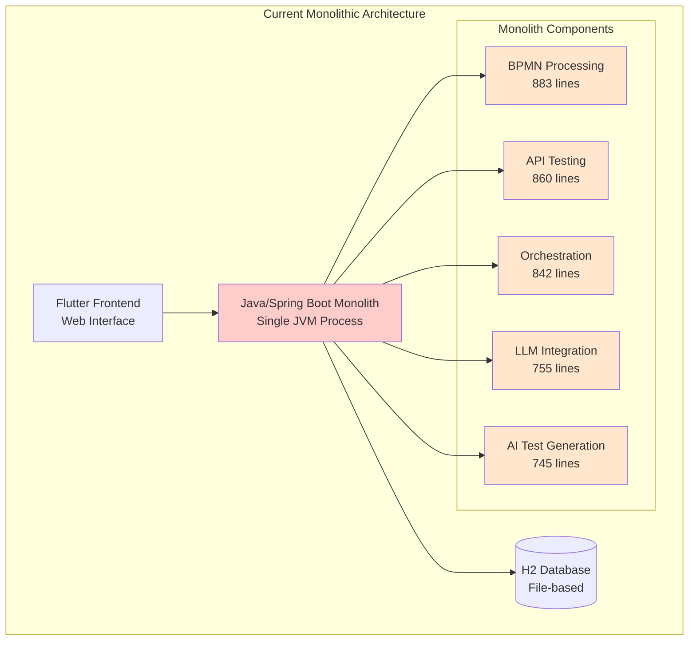
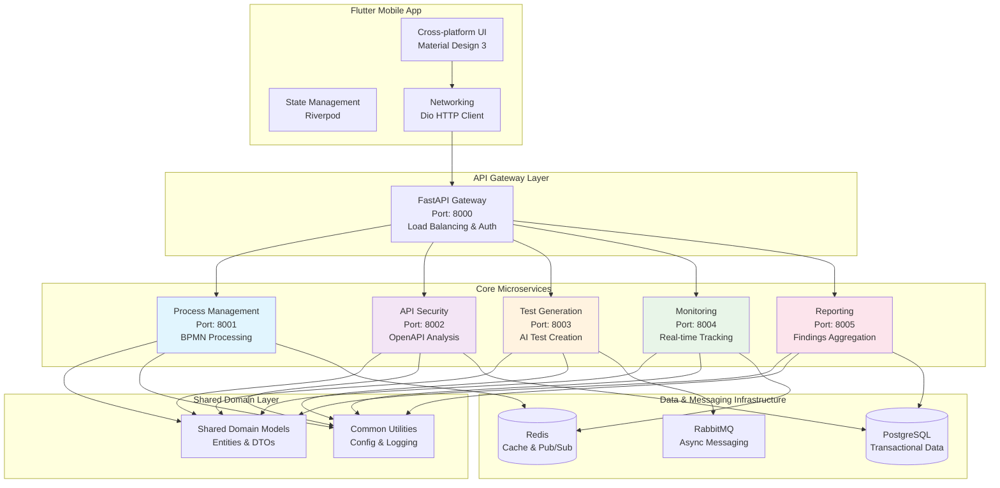
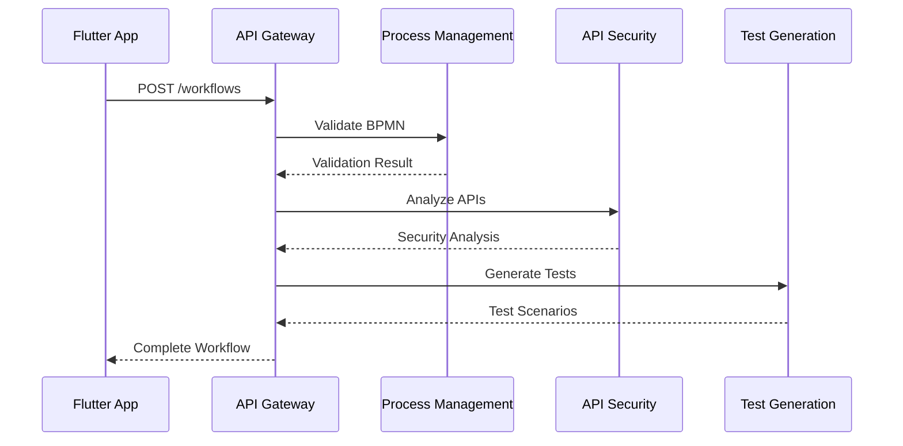
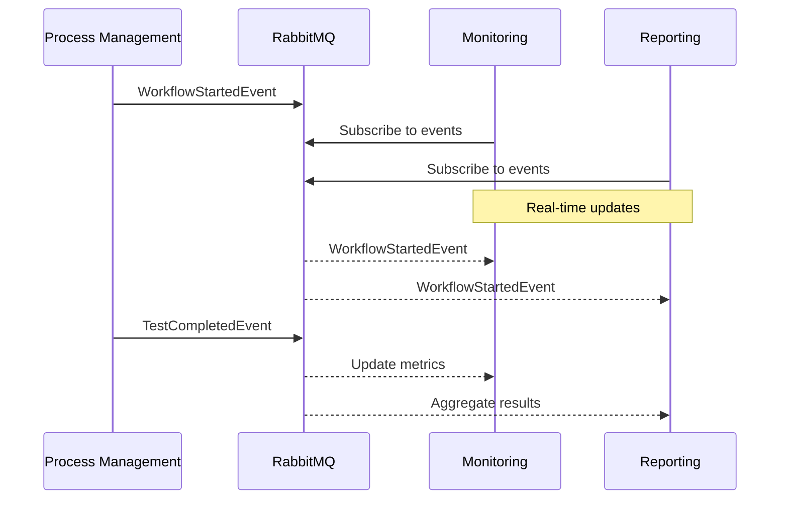
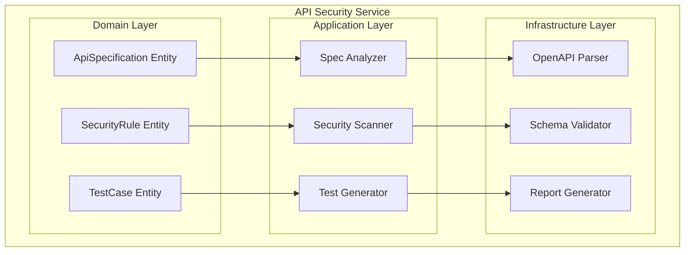
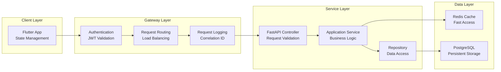

# SecurityOrchestrator: миграция к микросервисам и анализ безопасности API

## 1. Вводная часть

Сегодня я расскажу о том, как мы переводим систему SecurityOrchestrator с монолитной Java/Spring Boot архитектуры на микросервисы на базе FastAPI и Flutter, и как внутри этого ландшафта устроен функционал анализа безопасности API и Swagger-спецификаций.

Текущая система — это Java/Spring Boot монолит с Flutter‑фронтендом. В монолите есть крупные файлы по 800+ строк, высокая цикломатическая сложность, плотное сцепление модулей BPMN‑обработки, API‑тестирования, оркестрации и интеграции с LLM. Это затрудняет сопровождение и масштабирование.

Цель миграции — перейти к набору независимых микросервисов: FastAPI‑сервисы плюс Flutter‑клиент, с явным разделением доменов и возможностью масштабировать отдельно те части, которые дают максимальную нагрузку.

## 2. Текущее состояние архитектуры (монолит)

### 2.1 Ключевые характеристики

- Java/Spring Boot монолит, один JVM‑процесс
- Плотно связанные компоненты: BPMN, API‑тесты, оркестрация, LLM‑интеграция, AI‑генерация тестов
- H2‑база данных, общий пул ресурсов
- Долгие релизные циклы, высокий риск изменений

### 2.2 Диаграмма текущей архитектуры

### 2.3 Основные проблемы монолита

- **Tight Coupling**: все компоненты в одном процессе
- **Large Files**: большие классы с 800+ строк кода
- **Scalability Limits**: нельзя масштабировать отдельные функции
- **Performance Bottlenecks**: синхронная обработка ограничивает конкуррентность

## 3. Целевая микросервисная архитектура

### 3.1 Основные компоненты

- 5 доменных микросервисов на FastAPI:
  - Process Management (BPMN и оркестрация)
  - API Security (анализ OpenAPI/Swagger)
  - Test Generation (AI‑генерация тестов)
  - Monitoring (метрики и health‑checks)
  - Reporting (отчёты по безопасности)
- Flutter‑приложение с Riverpod‑стейт‑менеджментом
- Общий слой `shared/` для доменных моделей, DTO и событий
- Инфраструктура: Docker, Kubernetes, PostgreSQL, Redis, RabbitMQ, Prometheus/Grafana

### 3.2 Диаграмма целевой архитектуры

### 3.3 Шаблон Clean Architecture внутри сервиса

Каждый микросервис следует шаблону Чистой архитектуры:

- **Domain**: сущности, value‑объекты, доменные сервисы
- **Application**: use‑case‑сервисы, DTO, обработчики событий
- **Infrastructure**: репозитории, внешние клиенты, конфигурация, БД
- **Presentation**: REST‑эндпоинты FastAPI, схемы, middleware

## 4. Взаимодействие сервисов

### 4.1 Синхронное взаимодействие (HTTP/REST)

### 4.2 Асинхронное взаимодействие (события)

## 5. Сервисы API Security и анализ Swagger

### 5.1 API Security Service (домен OpenAPI & Security)

### 5.2 Функциональность анализа безопасности

- Анализ одиночных и множества API‑эндпойнтов
- Проверка протокола (HTTP/HTTPS), admin‑эндпойнтов, версионирования API
- Анализ Swagger/OpenAPI‑спецификаций:
  - общее количество эндпойнтов
  - защищённые и незащищённые эндпойнты
  - устаревшие (deprecated) эндпойнты
- Оценка безопасности (0–100), уровни критичности, рекомендации
- Опциональный AI‑анализ через LLM‑модель для детальных отчётов

## 6. Поток данных при вызове API

## 7. Этапы миграции и выгоды

- **Фаза 1**: каркас микросервисов, shared‑модели, инфраструктура
- **Фаза 2**: реализация ключевых сервисов (API Security, Test Generation)
- **Фаза 3**: интеграция, событийное взаимодействие, отключение монолита

Результат:

- масштабируемость по отдельным доменам
- независимые релизы сервисов
- более чистая архитектура кода
- лучшая платформа для развития функций безопасности и тестирования

