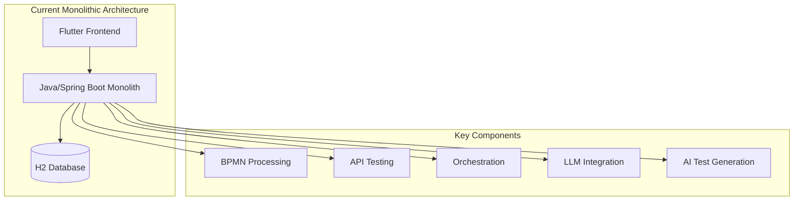
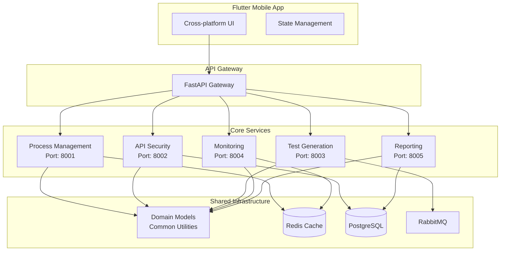

# SecurityOrchestrator Migration Roadmap

## Executive Summary

This document outlines a comprehensive 6-month migration plan from the current Java/Spring Boot monolithic architecture to a FastAPI microservices architecture with Flutter frontend. The migration focuses on improving performance and scalability while maintaining business continuity.

### Project Overview

- **Current State**: Java/Spring Boot monolith with Flutter frontend (863+ line files, complex dependencies)
- **Target State**: FastAPI microservices (5 services) + Flutter mobile app
- **Timeline**: 6 months with small team (2-4 developers)
- **Business Priority**: Performance and scalability improvements

### Migration Rationale

1. **Performance Bottlenecks**: Monolithic architecture limits concurrent processing capabilities
2. **Scalability Issues**: Difficult to scale individual features independently
3. **Technology Debt**: Large files (>800 lines) violate clean architecture principles
4. **Team Productivity**: Slow development cycles due to tight coupling
5. **Future-Proofing**: Microservices enable faster feature development and deployment

## Current State Analysis

### Architecture Overview

### Technical Pain Points

#### Code Quality Issues
- **Large Files**: Multiple files exceed 800+ lines (BpmnContextExtractor.java: 883 lines)
- **High Complexity**: Cyclomatic complexity violations in core business logic
- **Tight Coupling**: Strong dependencies between BPMN, API testing, and orchestration modules
- **Mixed Responsibilities**: Controllers handling both HTTP and business logic

#### Performance Limitations
- **Synchronous Processing**: Blocking operations limit concurrent test execution
- **Memory Constraints**: Large monolithic JVM footprint
- **Resource Contention**: Single database connection pool for all operations
- **Scalability Bottlenecks**: Cannot scale individual features independently

#### Development Challenges
- **Long Build Times**: Full rebuild required for any change
- **Testing Complexity**: Integration tests require entire application startup
- **Deployment Risk**: Any code change risks entire system stability
- **Technology Lock-in**: Heavy Java/Spring ecosystem dependency

### Business Impact
- **Slow Feature Delivery**: 2-3 weeks for new feature deployment
- **Limited Concurrent Users**: Maximum 50 concurrent security tests
- **High Operational Costs**: Resource-intensive monolithic deployment
- **Innovation Barriers**: Difficulty adopting new technologies or patterns

## Target Architecture

### Microservices Design

### Service Boundaries

#### 1. Process Management Service (Port: 8001)
**Responsibilities:**
- BPMN workflow parsing and validation
- Process execution orchestration
- Workflow state management

**Domain Boundaries:**
- Process entities and workflows
- BPMN parsing logic
- Execution pipelines

#### 2. API Security Service (Port: 8002)
**Responsibilities:**
- OpenAPI specification analysis
- Security policy validation
- API endpoint testing

**Domain Boundaries:**
- API specifications and schemas
- Security rules and validations
- Test case generation for APIs

#### 3. Test Generation Service (Port: 8003)
**Responsibilities:**
- AI-powered test data generation
- Scenario creation and optimization
- LLM integration for intelligent testing

**Domain Boundaries:**
- Test data models and generation
- AI/ML model management
- Intelligent test scenario creation

#### 4. Monitoring Service (Port: 8004)
**Responsibilities:**
- Real-time execution tracking
- Performance metrics collection
- Health monitoring and alerting

**Domain Boundaries:**
- Metrics collection and aggregation
- Alert definitions and notifications
- System health monitoring

#### 5. Reporting Service (Port: 8005)
**Responsibilities:**
- Security findings aggregation
- Report generation and formatting
- Historical data analysis

**Domain Boundaries:**
- Report templates and generation
- Data aggregation and analysis
- Export functionality

### Technology Stack Decisions

#### Backend Services
- **Framework**: FastAPI (Python 3.11+) - High performance, async-first design
- **Architecture**: Clean Architecture with domain-driven design
- **API**: REST with OpenAPI 3.0+ specifications
- **Communication**: HTTP for service-to-service, RabbitMQ for events

#### Data Layer
- **Primary Database**: PostgreSQL - ACID compliance, complex queries
- **Cache**: Redis - High-performance caching, pub/sub
- **Message Queue**: RabbitMQ - Reliable async messaging

#### Frontend
- **Framework**: Flutter 3.x+ - Cross-platform mobile development
- **State Management**: Riverpod - Reactive state management
- **Networking**: Dio - HTTP client with interceptors

#### Infrastructure
- **Containerization**: Docker - Service isolation and portability
- **Orchestration**: Kubernetes - Production deployment and scaling
- **CI/CD**: GitHub Actions - Automated testing and deployment

### Rationale for Technology Choices

#### FastAPI over Other Frameworks
- **Performance**: Async-first design handles high concurrency better than Flask/Django
- **Developer Experience**: Auto-generated OpenAPI docs, type hints, dependency injection
- **Ecosystem**: Rich async libraries for AI/ML integration
- **Migration Ease**: Python allows gradual adoption alongside Java monolith

#### Microservices over Modular Monolith
- **Scalability**: Independent scaling of services based on load patterns
- **Technology Diversity**: Different services can use different technologies if needed
- **Failure Isolation**: Service failures don't cascade to entire system
- **Team Autonomy**: Teams can work independently on different services

#### Flutter for Mobile Experience
- **Cross-platform**: Single codebase for iOS, Android, Web
- **Performance**: Native compilation, smooth animations
- **Developer Productivity**: Hot reload, rich widget ecosystem
- **Future-proofing**: Google's commitment to the platform

## Detailed Migration Phases

### Phase 1: Foundation (Weeks 1-8)
**Goal**: Establish migration infrastructure and shared components

#### Week 1-2: Project Setup
**Deliverables:**
- Microservices project structure
- Shared domain models and DTOs
- Docker development environment
- CI/CD pipeline setup

**Team Allocation:**
- 2 developers: Infrastructure and shared components
- 1 developer: Domain modeling and API design

#### Week 3-4: Shared Components
**Deliverables:**
- Common utilities and configurations
- Domain entities and value objects
- Base service templates
- Authentication and authorization framework

#### Week 5-6: Process Management Service
**Deliverables:**
- BPMN parsing and validation
- Process execution engine
- Basic workflow management
- Service integration tests

#### Week 7-8: API Security Service
**Deliverables:**
- OpenAPI parsing and validation
- Basic security rule engine
- API endpoint analysis
- Service integration tests

### Phase 2: Core Services (Weeks 9-16)
**Goal**: Implement remaining core services

#### Week 9-10: Test Generation Service
**Deliverables:**
- AI-powered test data generation
- LLM integration framework
- Test scenario optimization
- Performance benchmarking

#### Week 11-12: Monitoring Service
**Deliverables:**
- Real-time metrics collection
- Health check endpoints
- Alert management system
- Dashboard integration

#### Week 13-14: Reporting Service
**Deliverables:**
- Report generation engine
- Data aggregation services
- Export functionality
- Historical analysis

#### Week 15-16: Service Integration
**Deliverables:**
- Inter-service communication
- Event-driven architecture
- API Gateway implementation
- End-to-end integration tests

### Phase 3: Frontend Migration (Weeks 17-20)
**Goal**: Migrate Flutter frontend to mobile-first design

#### Week 17-18: Flutter App Foundation
**Deliverables:**
- Mobile app project structure
- Authentication and navigation
- Basic service integration
- Offline capability framework

#### Week 19-20: Feature Migration
**Deliverables:**
- Core workflow management UI
- Real-time monitoring dashboard
- Report viewing and export
- Mobile-optimized interactions

### Phase 4: Production Readiness (Weeks 21-24)
**Goal**: Prepare for production deployment

#### Week 21-22: Infrastructure & DevOps
**Deliverables:**
- Kubernetes manifests
- Production Docker images
- Monitoring and logging setup
- Security hardening

#### Week 23-24: Testing & Validation
**Deliverables:**
- Performance testing suite
- Load testing scenarios
- Security testing integration
- Production deployment validation

## Risk Assessment and Mitigation

### High-Risk Items

#### 1. Data Consistency During Migration
**Risk**: Data corruption during parallel system operation
**Impact**: High - Could lose critical security test data
**Probability**: Medium
**Mitigation:**
- Implement dual-write strategy during transition
- Create data migration scripts with rollback capability
- Establish data validation checks
- Maintain database backups throughout migration

#### 2. Service Communication Failures
**Risk**: Microservices failing to communicate properly
**Impact**: High - System functionality breaks
**Probability**: Medium
**Mitigation:**
- Implement circuit breaker patterns
- Create comprehensive service mesh monitoring
- Establish retry and timeout policies
- Develop fallback mechanisms

#### 3. Performance Degradation
**Risk**: Microservices architecture introduces latency
**Impact**: Medium - User experience suffers
**Probability**: Medium
**Mitigation:**
- Conduct performance benchmarking before/after
- Implement caching strategies
- Optimize database queries
- Use async processing for long-running tasks

### Medium-Risk Items

#### 4. Team Learning Curve
**Risk**: Developers unfamiliar with Python/FastAPI
**Impact**: Medium - Development delays
**Probability**: High
**Mitigation:**
- Provide comprehensive training program
- Pair programming with experienced developers
- Create detailed documentation and examples
- Gradual transition with mentorship

#### 5. Third-party Dependencies
**Risk**: Breaking changes in FastAPI or Flutter
**Impact**: Medium - Development disruptions
**Probability**: Low
**Mitigation:**
- Pin dependency versions
- Monitor release notes and changelogs
- Create compatibility testing suite
- Maintain vendor relationships

### Low-Risk Items

#### 6. Infrastructure Complexity
**Risk**: Kubernetes adds operational complexity
**Impact**: Low - Learning curve for DevOps
**Probability**: Medium
**Mitigation:**
- Start with Docker Compose for development
- Use managed Kubernetes services
- Implement Infrastructure as Code
- Create automated deployment scripts

## Success Criteria and Validation

### Functional Success Criteria

#### Service-Level Requirements
- **Process Management**: Parse and execute BPMN workflows with 99.9% accuracy
- **API Security**: Analyze OpenAPI specs and identify security issues with 95% coverage
- **Test Generation**: Generate test data with 90% scenario coverage
- **Monitoring**: Track system metrics with <5 second latency
- **Reporting**: Generate comprehensive reports in <30 seconds

#### Integration Requirements
- **API Compatibility**: 100% backward compatibility with existing clients
- **Data Integrity**: Zero data loss during migration
- **Concurrent Users**: Support 200+ concurrent security tests
- **Response Times**: <2 second average API response time

### Non-Functional Success Criteria

#### Performance Metrics
- **Throughput**: 500+ security tests per minute
- **Latency**: <1 second for simple operations
- **Resource Usage**: 50% reduction in memory footprint
- **Scalability**: Auto-scale to handle 10x load increase

#### Quality Metrics
- **Test Coverage**: >85% code coverage across all services
- **Uptime**: 99.9% service availability
- **Error Rate**: <0.1% error rate for API calls
- **Security**: Pass all security scans and audits

### Validation Approach

#### Automated Testing
- **Unit Tests**: Domain logic and utility functions
- **Integration Tests**: Service-to-service communication
- **End-to-End Tests**: Complete user workflows
- **Performance Tests**: Load and stress testing

#### Manual Validation
- **User Acceptance Testing**: Business stakeholder validation
- **Security Testing**: Penetration testing and vulnerability scans
- **Compatibility Testing**: Cross-browser and cross-device testing
- **Accessibility Testing**: WCAG 2.1 compliance validation

#### Monitoring and Observability
- **Application Metrics**: Response times, error rates, throughput
- **Infrastructure Metrics**: CPU, memory, disk usage
- **Business Metrics**: User engagement, feature adoption
- **Security Metrics**: Threat detection, incident response time

## Resource Requirements and Team Structure

### Team Composition (Small Team: 2-4 Developers)

#### Architecture/Tech Lead (1 person)
**Responsibilities:**
- Technical architecture design and decisions
- Code review and quality assurance
- Stakeholder communication
- Technology stack evaluation

**Skills Required:**
- Microservices architecture experience
- Python/FastAPI expertise
- Flutter/Dart knowledge
- System design and scalability

#### Backend Developers (1-2 people)
**Responsibilities:**
- FastAPI service implementation
- Database design and optimization
- API design and documentation
- Integration testing

**Skills Required:**
- Python development (3+ years)
- REST API design
- Database design (PostgreSQL preferred)
- Docker and containerization

#### Frontend Developer (1 person)
**Responsibilities:**
- Flutter mobile app development
- UI/UX implementation
- State management
- Cross-platform optimization

**Skills Required:**
- Flutter/Dart development (2+ years)
- Mobile UI/UX design
- State management (Riverpod/BLoC)
- Cross-platform development experience

### Infrastructure Requirements

#### Development Environment
- **Hardware**: 16GB RAM minimum per developer workstation
- **Software**: Docker Desktop, VS Code, Python 3.11+, Flutter SDK
- **Cloud Resources**: AWS/GCP development accounts

#### Testing Environment
- **CI/CD**: GitHub Actions runners
- **Testing Tools**: Docker containers for isolated testing
- **Performance Testing**: JMeter or Locust for load testing

#### Production Environment
- **Kubernetes**: Managed K8s service (EKS/GKE)
- **Database**: Managed PostgreSQL (RDS/Cloud SQL)
- **Cache**: Managed Redis (ElastiCache/Memorystore)
- **Monitoring**: Prometheus/Grafana stack

### Training and Skill Development

#### Week 1-2 Training Program
- FastAPI fundamentals and async programming
- Flutter state management and architecture
- Docker and Kubernetes basics
- Domain-driven design principles

#### Ongoing Learning
- Weekly tech talks and knowledge sharing
- External conference attendance budget
- Online course subscriptions (Pluralsight, Udemy)
- Certification programs for key technologies

## Technology Stack Rationale

### Programming Languages

#### Python for Backend Services
**Advantages:**
- Rich ecosystem for AI/ML integration
- Excellent async programming support
- Strong typing with type hints
- Large community and libraries

**Migration Benefits:**
- Easier to learn than Java for new team members
- Faster development cycles
- Better integration with modern AI frameworks

#### Dart for Frontend
**Advantages:**
- Single language for mobile, web, desktop
- Compiled to native code for performance
- Strong typing and null safety
- Rich widget ecosystem

**Business Benefits:**
- Cross-platform development reduces costs
- Native performance on all platforms
- Hot reload speeds up development

### Frameworks and Libraries

#### FastAPI Ecosystem
- **FastAPI**: High-performance async web framework
- **Pydantic**: Data validation and serialization
- **SQLAlchemy**: ORM with async support
- **Alembic**: Database migration management

#### Flutter Ecosystem
- **Riverpod**: Declarative state management
- **Dio**: HTTP client with interceptors
- **Go Router**: Declarative routing
- **Flutter Hooks**: Functional programming patterns

### Infrastructure Components

#### Containerization and Orchestration
- **Docker**: Service isolation and portability
- **Kubernetes**: Production-grade orchestration
- **Helm**: Package management for K8s applications

#### Data and Messaging
- **PostgreSQL**: ACID-compliant relational database
- **Redis**: High-performance cache and pub/sub
- **RabbitMQ**: Reliable message queuing

#### Monitoring and Observability
- **Prometheus**: Metrics collection and alerting
- **Grafana**: Dashboard and visualization
- **ELK Stack**: Log aggregation and analysis

This migration roadmap provides a comprehensive plan for transforming SecurityOrchestrator from a monolithic Java application to a scalable FastAPI microservices architecture. The phased approach ensures business continuity while delivering significant improvements in performance, scalability, and maintainability.