# Architecture Diagrams

## Current State Architecture

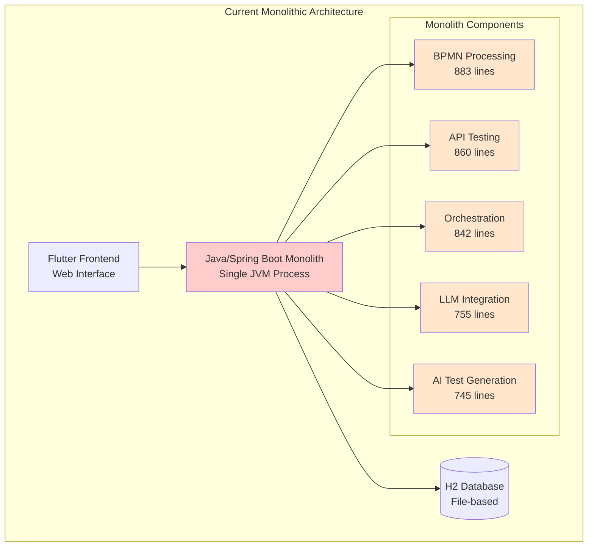

### Current State Issues
- **Tight Coupling**: All components in single JVM process
- **Large Files**: Critical files exceed 800+ lines
- **Scalability Limits**: Cannot scale individual features
- **Performance Bottlenecks**: Synchronous processing limits concurrency

## Target Microservices Architecture

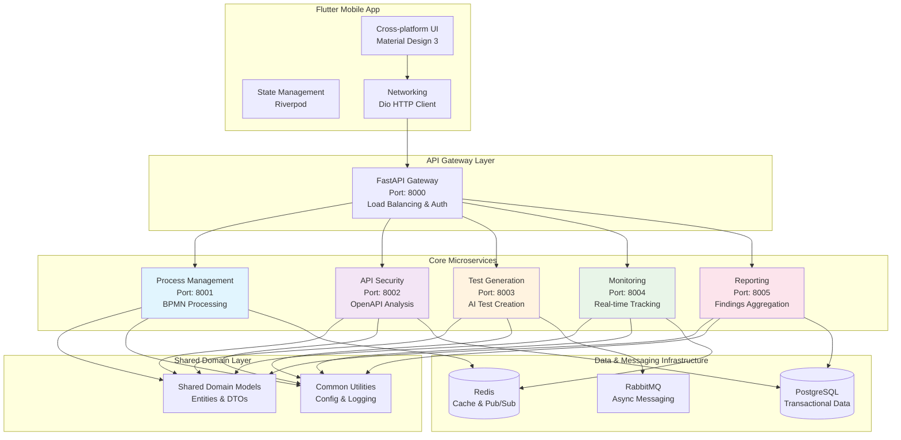

## Service Interaction Patterns

### Synchronous Communication (HTTP/REST)

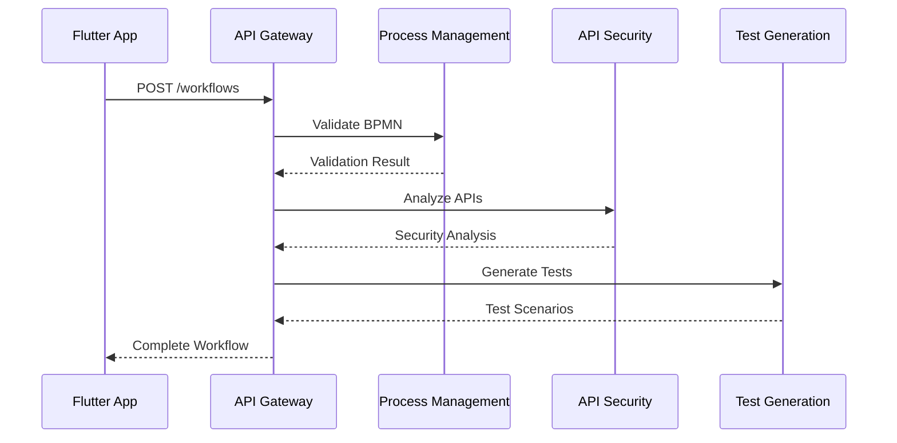

### Asynchronous Communication (Events)

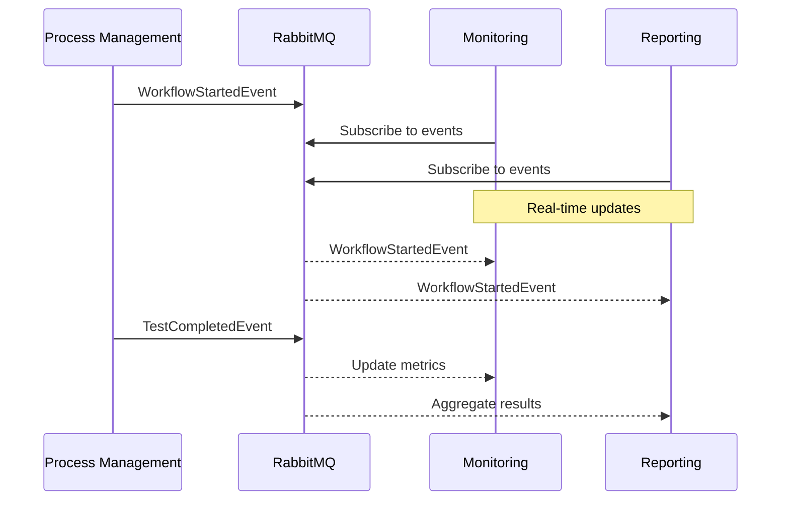

## Service Boundaries and Responsibilities

### Process Management Service (Domain: BPMN & Workflow)

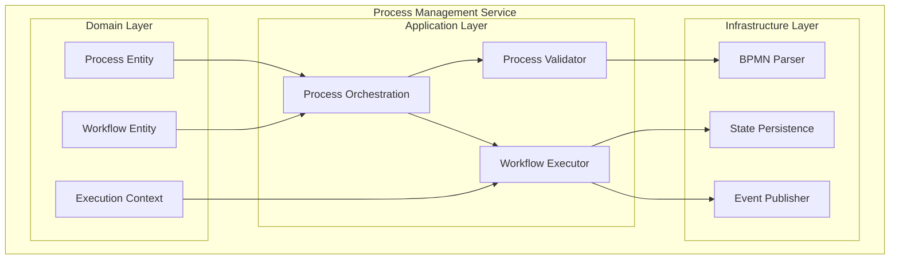

### API Security Service (Domain: OpenAPI & Security)

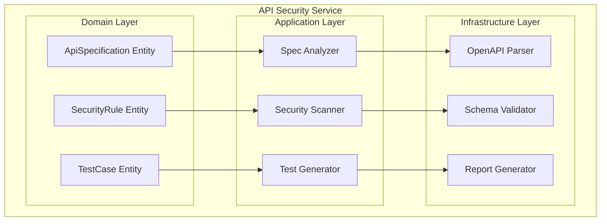

## Data Flow Architecture

### Request Flow (API Call)

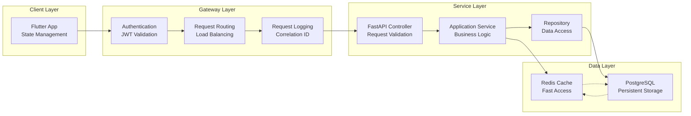

### Event Flow (Async Processing)

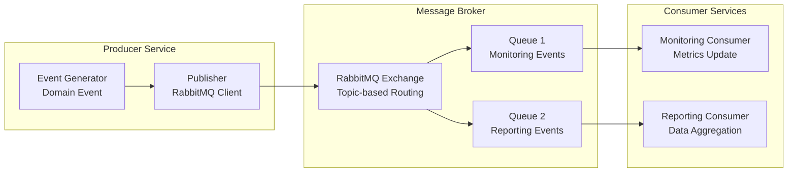

## Deployment Architecture

### Development Environment

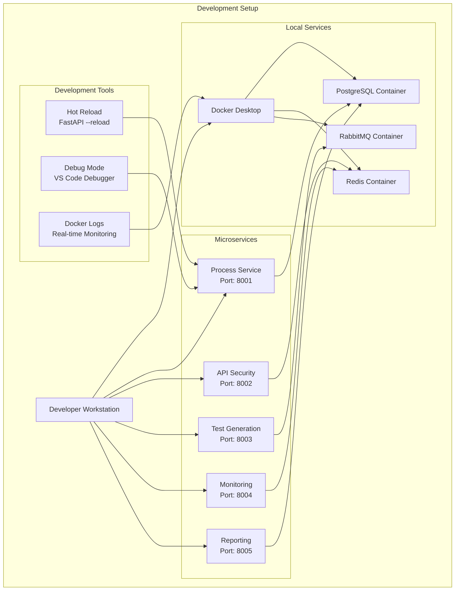

### Production Environment

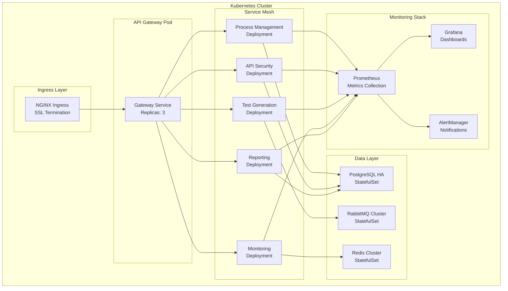

## Migration Transition Architecture

### Phase 1-2: Parallel Systems

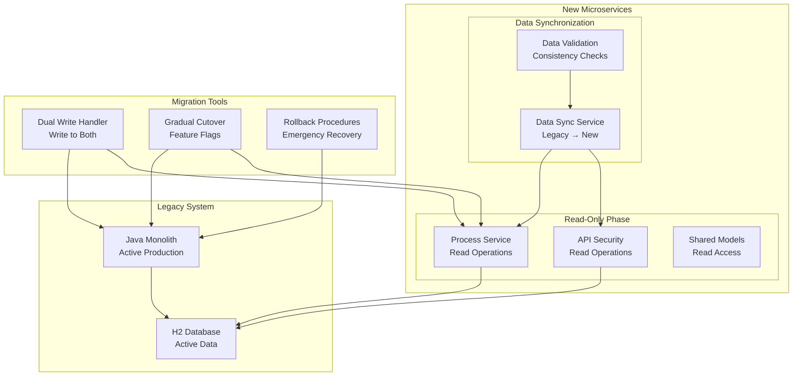

### Phase 3-4: Full Migration

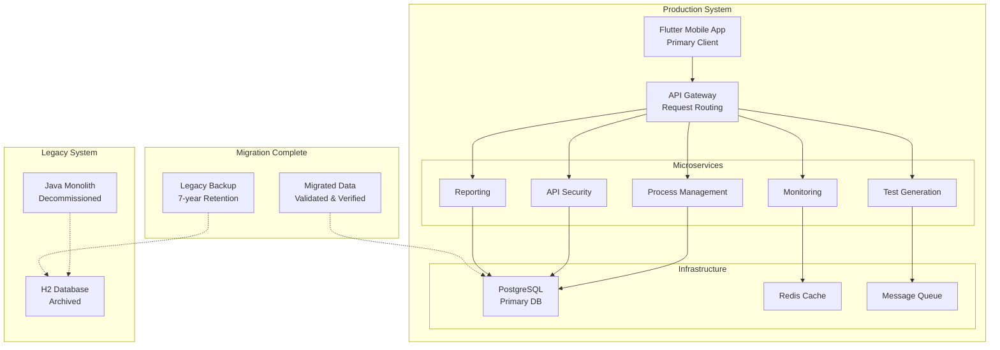

## Performance and Scalability Projections

### Current State Performance

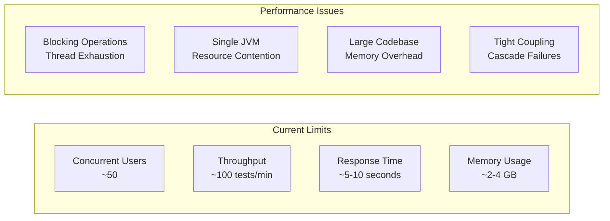

### Target State Performance

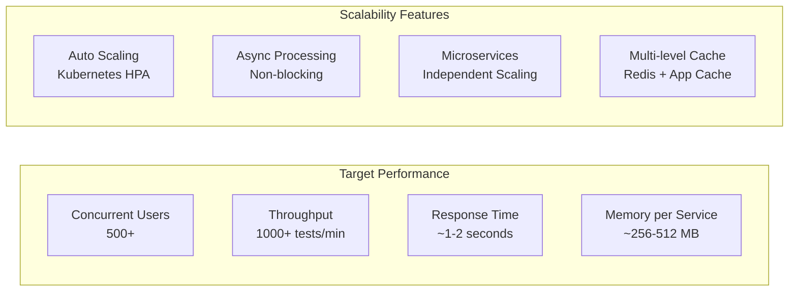

### Scalability Scenarios

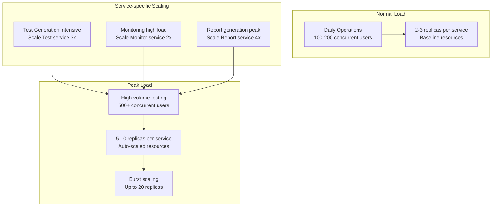

These diagrams provide a comprehensive visual representation of the SecurityOrchestrator migration from monolithic to microservices architecture, showing the current state, target architecture, and migration transition phases.